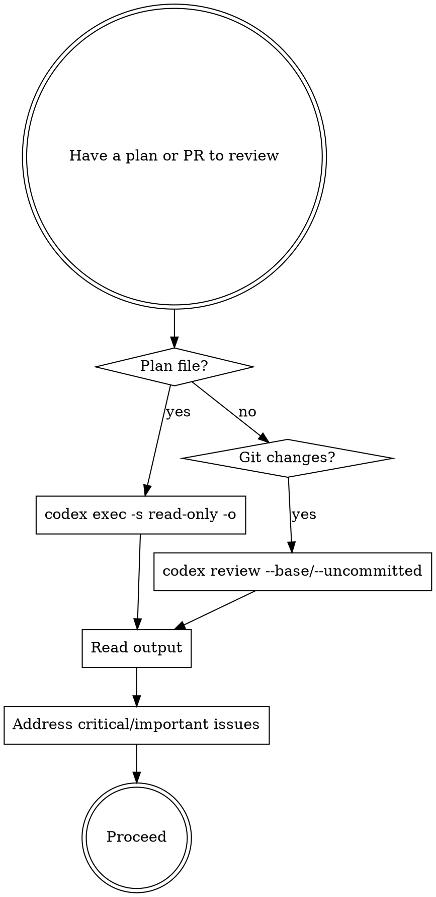

# Codex Review

Dispatch OpenAI Codex CLI to independently review plans, PRs, or code changes.

**Core principle:** Get a second opinion from a different AI before committing to implementation or merging code.

## When to Use

- Before implementing a design/implementation plan
- Before merging a PR
- When reviewing significant code changes
- When you want an independent perspective on architecture decisions

## Review Modes

### 1. Review a Design/Implementation Plan

Use `codex exec` in read-only sandbox with `-o` to capture output:

```bash
codex exec -s read-only -o /tmp/codex-review.txt "Review the plan at <file-path> for:
- Gaps, missing steps, or incorrect assumptions
- Potential issues that should be addressed before implementation
- Ordering problems (dependencies between tasks)
- Security, performance, or maintainability concerns
Provide specific, actionable feedback organized by severity (critical, important, minor)."
```

Then read `/tmp/codex-review.txt` for the findings.

If not inside a git repo, add `--skip-git-repo-check`.

### 2. Review a PR (Branch Diff)

Use `codex review` to review changes against a base branch:

```bash
codex review --base main "Review these changes for:
- Bugs, logic errors, or edge cases
- Security vulnerabilities
- Missing error handling
- Code style and consistency issues
Provide specific, actionable feedback organized by severity."
```

### 3. Review Uncommitted Changes

```bash
codex review --uncommitted "Review these staged and unstaged changes for bugs, security issues, and code quality problems."
```

### 4. Review a Specific Commit

```bash
codex review --commit <SHA> "Review this commit for correctness and quality."
```

## Key Flags

| Flag | Purpose |
|------|---------|
| `-s read-only` | Sandbox: read-only (safe for plan review) |
| `-o <file>` | Write final agent message to file (use for capturing output) |
| `-m <model>` | Override model (e.g., `o3`, `o4-mini`) |
| `--skip-git-repo-check` | Allow running outside a git repo (for `exec` only) |
| `--base <branch>` | Diff against branch (for `review`) |
| `--uncommitted` | Review all uncommitted changes |
| `--commit <SHA>` | Review a specific commit |
| `--full-auto` | Auto-approve tool use in sandbox |

## Workflow



## Example: Reviewing a Plan

```
User: Review docs/plans/2026-02-19-01-core-infrastructure.md before we implement it

You: I'll dispatch Codex to review this plan independently.

[Run via Bash tool with ~120s timeout]:
codex exec -s read-only -o /tmp/codex-plan-review.txt \
  "Review the implementation plan at docs/plans/2026-02-19-01-core-infrastructure.md. Identify:
1. Missing steps or gaps
2. Incorrect assumptions about the tech stack
3. Task ordering issues (dependency problems)
4. Security or performance concerns
5. Suggestions for improvement
Be specific and actionable. Organize by severity: critical, important, minor."

[Read /tmp/codex-plan-review.txt]
[Summarize findings to user, organized by severity]
[Address critical issues before proceeding with implementation]
```

## Important Notes

- `codex exec` output goes to stderr/TUI by default. **Always use `-o <file>`** to capture the final response.
- `codex review` is git-diff-based; use `codex exec` for reviewing arbitrary files like plans.
- Run Bash with a timeout (120000ms+) since Codex reviews can take a while.
- Codex may produce no stdout even on success - the `-o` flag is essential.
- Summarize key findings for the user rather than dumping raw output.
